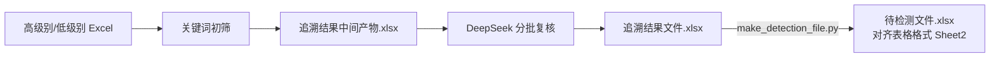

# Trace-relationship-maker

需求追溯关系自动识别工具集：**关键词初筛 + 大语言模型（DeepSeek）复核**，并可把复核通过的追溯关系生成为与 `表格格式.xlsx` 的 Sheet2 版式一致的「待检测文件」。

## 功能流程

1. **筛选**：分别筛选两个 Excel 中「是否需求」= TRUE 的高级别 / 低级别需求。
2. **关键词初筛**：从高级别「描述」列提取变量名（如 `MAX_SPEED`，须含大写字母与下划线、长度 ≥ 2），若低级别正文（优先「标题和正文」，缺失时用「描述」）中出现相同变量，则记为一条**候选追溯关系**，去重后写入 `追溯结果中间产物.xlsx`（列：高级别需求标识、低级别需求标识）。
3. **大模型复核**：读取中间产物，按标识从原始表取回双方描述拼入提示词，分批调用 DeepSeek 判定是否存在真实追溯关系。
4. **输出**：合并 LLM 判定写入 `追溯结果文件.xlsx`（列：高级别需求标识、低级别需求标识、LLM判定、判定理由）。
5. **（可选）待检测文件**：`make_detection_file.py` 只取 `LLM判定=是` 的配对，并按高级别标识统一分组；同一高级别需求对应多条低级别需求时，左侧 6 列纵向合并。可直接复用指定模板的 Sheet2 版式，也可在不传模板时生成同结构文件。



## 目录结构

```
.
├── requirement_trace.py      # 追溯主程序（初筛 + DeepSeek 复核）
├── make_detection_file.py    # 由追溯结果生成待检测文件（Sheet2 版式）
├── install_offline_deps.bat  # 依赖安装脚本（离线/在线）
├── requirements.txt          # 在线安装依赖清单
├── offline_wheels/           # 离线轮子（cp314，pandas 3.0.5 等 7 个）
└── tests/                    # 待检测文件生成逻辑的自动化测试
```

## 安装依赖

```bat
:: 离线机（需 Python 3.14，对应 offline_wheels 的 cp314 轮子）
install_offline_deps.bat

:: 有网机器（Python 3.11+ 皆可，按 requirements.txt 从 PyPI 安装）
install_offline_deps.bat online
```

> 两个脚本只需 **pandas + openpyxl**：复核大模型用标准库 `urllib` 直连、`make_detection_file.py` 用 openpyxl 生成合并单元格，**均无需新增第三方包**；离线机无法联网复核时，把 `requirement_trace.py` 中 `ENABLE_LLM_REVIEW` 改为 `False`，仅生成中间产物。

## 使用

1. 修改 `requirement_trace.py` 配置区：
   - 高/低级别输入文件路径、`INTERMEDIATE_FILE`、`FINAL_FILE`；
   - `LLM_API_KEY`（或设置环境变量 `DEEPSEEK_API_KEY`）。
2. 运行追溯：

```bash
python requirement_trace.py
# 或临时指定文件（覆盖配置区）：
python requirement_trace.py 高级别.xlsx 低级别.xlsx 中间产物.xlsx 最终结果.xlsx
```

3. 由三个输入 Excel 生成待检测文件：

```bash
python make_detection_file.py
# 推荐：直接传入三个输入文件和输出路径
python make_detection_file.py 高级别.xlsx 低级别.xlsx 追溯结果.xlsx 待检测.xlsx

# 需要严格复用现有模板的样式、列宽等版式时（默认读取模板的 Sheet2）
python make_detection_file.py 高级别.xlsx 低级别.xlsx 追溯结果.xlsx 待检测.xlsx --template 表格格式.xlsx

# 如果目标版式不在 Sheet2，可另外指定工作表名
python make_detection_file.py 高级别.xlsx 低级别.xlsx 追溯结果.xlsx 待检测.xlsx --template 表格格式.xlsx --template-sheet 追溯关系
```

输入和输出规则：

- 高/低级别需求文件必须包含「标识」，正文优先读取「标题和正文」，也支持「正文」或「描述」；如有「名称」或「标题」，会写入输出的「名称」列。
- 追溯关系文件必须包含「高级别需求标识」「低级别需求标识」「LLM判定」。只输出肯定判定（`是`，同时兼容布尔 `TRUE`、`yes` 和 `1`），重复配对自动去重。
- 输出为左侧「软件高级别需求」、右侧「下游低级别需求」，每侧表头均为「标识 / 名称 / 描述 / 是否需求 / 是否派生 / 原理」。两侧「是否需求」统一写入 Excel 布尔值 `TRUE`，「是否派生」统一写入布尔值 `FALSE`。
- 同一高级别标识即使在追溯关系文件中不连续出现，也会先稳定归组，再合并左侧单元格。

运行自动化测试：

```bash
python -m unittest discover -s tests -v
```
